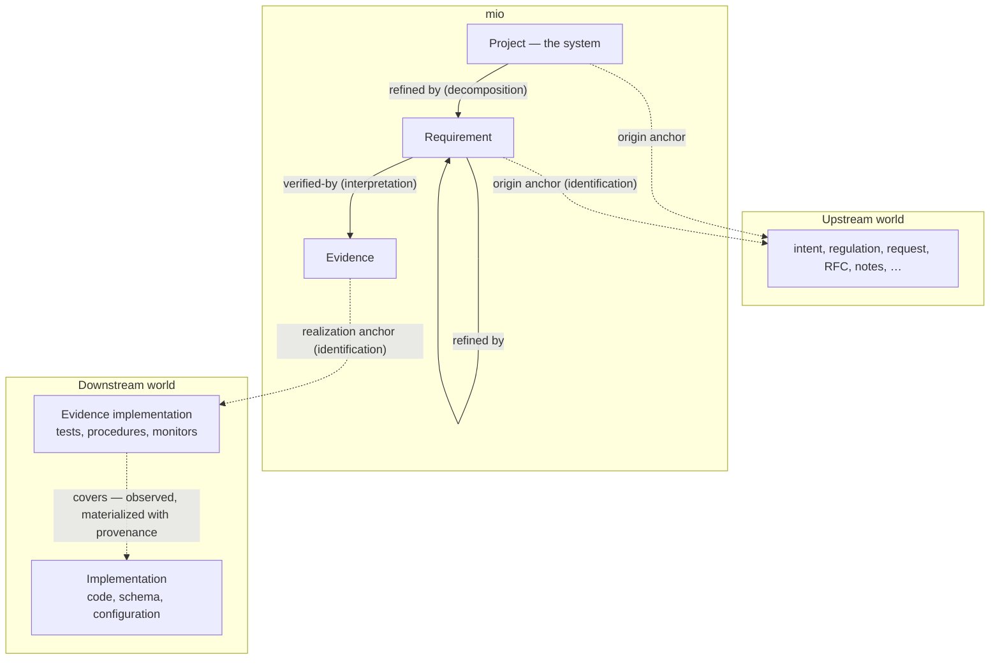

mio holds the trace of your system: each requirement, the evidence that verifies it, and the implementation that evidence demonstrably covers — one graph, from intent all the way down. Ask it for exactly the part you need to understand; what has no trace surfaces on its own.

## The name

*Mio* (澪) is Japanese for the navigable channel through the shallow water of an estuary. The water looks open in every direction, yet a boat runs aground almost everywhere — and the channel never stops shifting, so it must be marked, and the marks maintained.

A software system is that estuary: to get anywhere in it without running aground, you need the marks. You could survey the whole of it instead — drain it dry — but only at unreal cost (say, your entire token budget). mio keeps the marks on the navigable channel: a trace from intent, to evidence, to implementation.

## Why mio exists

Developing with agents, we stopped reading — first the code the agents write, then the tests — and by now even we who are building the system are losing hold of our understanding of it. The artifacts keep growing; the understanding does not feel like it is keeping up.

Grasping the whole of a system has always mattered; that has not changed. But the feeling of holding the whole picture came from writing the code ourselves — and the writing has already been handed over; the understanding left with it. So we need another way of assembling understanding, one that does not pass through writing the code.

mio is an attempt at that other way. It builds the trace of a system — from requirements, through the evidence that verifies them, down to the implementation — one graph that does more than help you grasp the whole. It makes two things possible.

**Finding what is missing and what is extra.** Two axes — whether a requirement defines it, and whether an implementation exists — turn the system's completeness into a table:

|  | Implementation exists | Implementation missing |
| --- | --- | --- |
| **Requirement defined** | Traced | A promise not yet kept |
| **No requirement** | Excess — undocumented behavior, a latent requirement worth excavating | — |

**Progressive disclosure, for agents and systems.** Follow the trace, and the slice that matters for a task can be cut out and handed over: a finite context loaded with only the right part, known to be right.

The future mio aims at looks like this: a human reads the trace to grasp the whole of the requirements, finds what is missing and what is extra against the implementation, and asks an agent to close the gap — and the agent receives the intent of that work, which requirement it serves and which evidence it must satisfy, in the smallest context that carries it.

## The model

mio stores exactly two kinds of material, and the distinction is the design: **judgments**, which cannot be recomputed, and **observations**, which always can be.

### The authored layer — judgments

Two node kinds, authored by humans and agents:

| Node | What it is |
| --- | --- |
| **Project** | Exactly one per graph: the system itself — its name, and a distilled statement of what it is and why it exists. Top-level requirements refine it. |
| **Requirement** | A statement of intent: what the system must do, or be. |
| **Evidence** | A statement of how one requirement is verified: "there should be a test that…". Not code — it may be realized as a unit test, an integration test, a manual procedure, or a production monitor. |

connected by two kinds of authored links, each recording a distinct species of judgment:

- **refines** (finer requirement → the coarser node it refines, up to the project node) records a *decomposition*: a coarse intent broken into finer ones. Requirements form a tree — grain always varies across a real system, and the tree is what absorbs it. Nothing else in the model is hierarchical.
- **verified-by** (requirement → evidence) records an *interpretation*: translating intent into a verification strategy. Several correct answers can exist; this is where taste and rigor live.
- An **anchor** (node → the world) records an *identification*: the claim that a concrete artifact outside the graph plays a role for this node. An anchor is a durable, typed pointer — never a copy. An anchor grounds meaning; it never carries it: every node's meaning lives in its own authored text, and the anchor is what makes that text auditable against its source. Two roles are canonical:
  - **origin** — upstream: the regulation, customer request, RFC, or meeting note a requirement distills; on the root, typically the project's intent document. Inert metadata; nothing is derived through it.
  - **realization** — downstream, on an evidence node: points at an **evidence implementation** — the test function, checklist, or alert rule that implements the verification. The observed layer flows from here.

Any authored node may also carry **tags**: inert classifications that select views across the tree — error handling, security, the upstream slice a manager reads. Nothing flows through a tag: it never affects satisfaction and never forms a second hierarchy. Structure expresses what structure can, and tags express the facets that cut across it — note that a node's depth in the tree is not such a facet: how upstream or technical a requirement is does not follow from where it sits. Tag vocabulary is curated by convention (the bundled skills), not by schema.

### Cardinality and satisfaction

One requirement is verified by many evidence nodes, and evidence is never shared: the same verification stated for two requirements is written as two evidence nodes. Sharing happens in the world instead — several evidence nodes may anchor the same test.

Satisfaction is conjunction all the way down. A requirement is verified when every one of its evidence nodes is realized and every requirement that refines it is verified. An evidence node is realized by its whole set of evidence implementations together — keep each one small, and let the set carry the verification; every anchor claims one part of how the evidence is realized, and the sufficiency of the set is itself a judgment, auditable like any other. There is no OR and no grouping construct anywhere in the model. The same rule reaches the top: the project is verified when everything that refines it is.

### The observed layer — facts

- **covers** (evidence implementation → implementation) — the one observed link: which parts of the implementation an evidence implementation actually exercises when it runs. A set of places, not a percentage. Typically production code, though nothing narrows it to code — a schema, a configuration, an infrastructure definition can be covered the same way. Places come in grains — a line, a function, a module, an endpoint, a whole service — and the link is recorded at the grain observation honestly supports: exact lines for a unit test, the endpoints a load-test scenario drives (readable from the scenario itself), or nothing at all for a whole-system property, where the channel simply ends at the evidence implementation. Coarseness and absence stay visible; they are never padded into false precision. Recovered from per-test execution, call relations, or the evidence implementation's own definition, covers is materialized in the graph together with its provenance (the commit, time, and method it was derived from) the way a lockfile materializes resolved dependencies: committed, self-contained, portable — and never the authority. Drift is not tolerated but *detected*: recompute, diff against what is stored. Derivation need not be fully mechanical: where measurement cannot reach — a manual procedure, a production monitor — an agent may infer the association instead, and because the method travels with the provenance, a measured fact and an inferred one are never confused.

Every arrow in this picture is a record mio holds — the three judgments and the one observation alike. The worlds own the artifacts; mio owns the trace, all the way down to the implementation.

### Why this shape holds

Traceability schemes that link design documents to code rot for a structural reason: interpretation is smeared across every artifact, every change demands re-interpretation, and the interpretations cannot even be enumerated. In mio, everything stored is one of two things — **a judgment that is explicit, enumerable, and auditable one by one** (every edge and anchor can be read and challenged on its own), or **a fact that is recomputable** (what covers what can always be re-derived and checked). What rots is stored material that can be neither audited nor recomputed. This model contains none.

The same shape is why requirements that cannot be expressed in code still fit: an evidence node does not demand a test file. "The operator can restore a backup within 15 minutes" is realized by a rehearsal procedure; "p99 latency stays under 200 ms" by a production monitor. Both anchor, both trace.

## What the trace answers

Given a requirement, a task, or a diff, mio serves the subgraph that matters and nothing else.

- **Downward** — from a requirement, reach exactly the code that realizes it. An agent gets a bounded working context instead of a repository dump.
- **Upward** — from a code change, reach the evidence and requirements it touches. Review a diff in the vocabulary of requirements; translate a failing test into the requirement it violates.
- **The negative space** — what has no channel surfaces mechanically:

| Finding | Meaning |
| --- | --- |
| Requirement with no evidence | Unverified intent |
| Evidence with no realization | A promise not yet kept |
| A test no evidence claims | Undocumented behavior — a latent requirement worth excavating |
| Implementation nothing covers | Dark water: dead code, or a verification gap |

## Not the authority

mio's graph is never the source of truth. The code and the evidence implementations are; the graph is re-derivable against them, and drift between graph and reality is detected, not tolerated. The channel is not the water — it is the way through it.

## What mio is not

- **Not a test framework or runner.** mio reads what evidence implementations exercise; it does not own their execution.
- **Not a code-generation pipeline.** mio represents and reveals the system; it does not build it.
- **Not a documentation generator** — though human documentation is one of the views that can be drawn through it.

## Interfaces (planned)

A CLI and an MCP server over the same core, with bundled skills describing how the nodes should be written and used. Installable standalone, and as a plugin for the Utsusemi harness.

## Views that can be drawn (exploratory)

Anything that wants a bounded view of a system can draw it through the channel. Candidates under exploration, none promised:

- Bounded context service for implementation agents — the working set for a task, derived instead of curated.
- Impact analysis — a PR diff answered in requirements, not files.
- Living documentation for humans, generated per audience.
- A maintainer's board: which intent is verified, which is dark.
- Federation — multiple systems' graphs read together over MCP/REST into one map.

## Related work

mio owes its starting point to [TraceDev](https://arxiv.org/abs/2607.18886), a multi-agent framework that builds a traceability graph across requirements, design models, and code to ground agent-driven development. mio inherits the conviction that development should stand on requirement traceability, and departs twice: the graph faces outward — serving whoever must understand the system, not one pipeline's generation — and the middle layer is evidence rather than design models.
