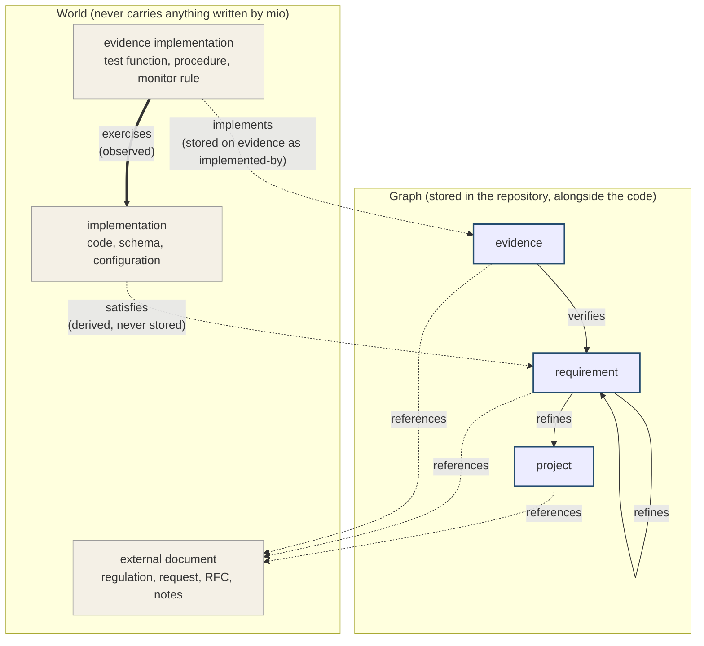

# mio — Model vocabulary (working draft, 2026-09-02)

Nouns and verbs of the graph, as settled in the spec conversation. Structure and
prose for `README.md` / `SPEC.md` will be organized later; this file only pins the
relationships so they are not re-derived.

## Diagram

Every arrow is an edge. Line style shows how the edge came to be: solid and
dotted arrows are judgments (dotted where one or both ends are outside the
graph), the thick arrow is the one observation, and the arrow from
implementation to requirement is derived: not a record at all, but what mio
computes by walking exercises → implements → verifies.

## Nouns

| Noun | Where it lives | What it is |
| --- | --- | --- |
| project | graph, exactly one | the system itself; root of the refines tree |
| requirement | graph | a statement of intent |
| evidence | graph | a statement of how one requirement is verified; belongs to exactly one requirement, never shared |
| evidence implementation | world | the artifact that implements an evidence: test function, checklist, alert rule. Always written as two words |
| implementation | world | what evidence implementations exercise: code, schema, configuration |
| target | value inside the graph | where in the world something is: `path` (repo-root-relative, `/` separated, optional `symbol` or `lines`) or `uri` (outside the repo) |
| edge | relation | any recorded relation. Its ends are node ids or targets; its origin is a judgment, an observation, or derived |

## Verbs

Two independent axes describe every edge. **Ends** says whether each end is a
node inside the graph or a target outside it. **Origin** says how the record
came to be: a *judgment* is asserted by a human or an agent, cannot be
recomputed from anything, and can only be audited one by one; an *observation*
can always be recomputed by measuring the world; *derived* is never stored and
is always recomputed from other edges.

| Verb | Subject → object | Ends | Origin | Stored on | Source of the word |
| --- | --- | --- | --- | --- | --- |
| refines | requirement → requirement \| project | node → node | judgment | the finer requirement | SysML refine |
| verifies | evidence → requirement | node → node | judgment | the evidence | SysML verify |
| implements | evidence implementation → evidence | target → node | judgment | the evidence, as `implemented-by` (the world cannot hold it) | ISTQB test implementation |
| exercises | evidence implementation → implementation | target → target | observation | the observed layer, with provenance | testing idiom |
| satisfies | implementation → requirement | target → node | derived | nowhere | SysML satisfy |
| references | any node → external document | node → target | judgment, inert | the node | plain word |

Rules that follow from the table:

- One-to-many references are held by the many side: an evidence names its one
  requirement, a requirement names its one parent. Downward traversal is an
  index built at load time.
- Everything pointing out of the graph is held by the graph, as a list of
  targets. Artifacts in the world never mention mio.
- Judgments (refines, verifies, implements, references) are authored and
  reviewed by humans and agents. Observations (exercises) are ingested from
  standard coverage formats or stated by an agent, and carry provenance saying
  which. Satisfies is never written down; it is always recomputed.
- exercises is the only edge with both ends outside the graph. It is still a
  record mio holds, keyed by the same targets that `implemented-by` uses, which
  is what joins the judgment layer to the observed layer.

## Deferred

Not yet settled and deliberately absent here: state adjectives (traced,
realized, dangling, …), freshness / `basis`, identifier format details,
file layout of the observed layer.
