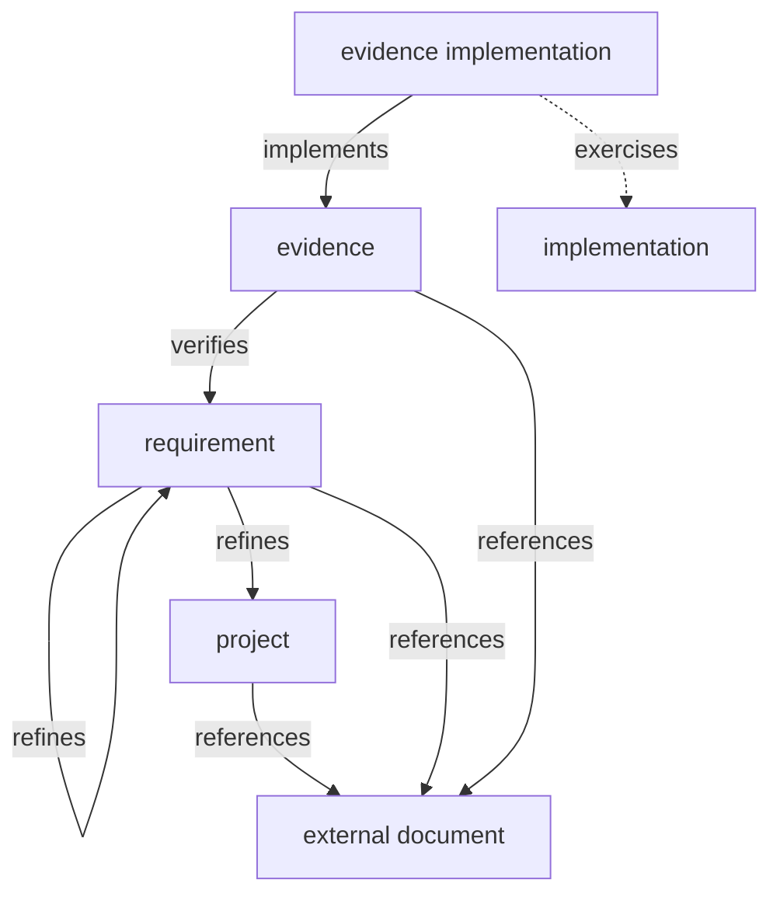

# mio — Model

Nodes, edges, and states of the traceability graph.

## Diagram



## Nodes

### Node attributes and representation

Every node is a Markdown file. The frontmatter holds its kind as `node`, its `id` assigned by mio, a `target` when it stands for an artifact, and, on an evidence implementation, `exercises`: the implementation it exercises, each written in the form of a `target`. The body is free prose; its first line is the node's subject, as in a git commit message, and a blank line separates it from the rest.

A `target` is the artifact the node stands for, either a `file` or a `uri`. A `file` has a `path` (repo-root-relative, `/`-separated, a file or a directory) and may have a `range` narrowing it to a `symbol` or to `lines` (`from` and `to`, inclusive). Artifacts never carry anything written by mio.

| Node | Is |
| --- | --- |
| project | the system; exactly one; what every requirement ultimately refines |
| requirement | a statement of intent |
| evidence | how one requirement is verified; belongs to exactly one requirement |
| external document | what a node references |
| evidence implementation | what implements an evidence: a test function, a checklist, an alert rule |
| implementation | what evidence implementations exercise: code, schema, configuration |

### Graph representation

The graph JSON holds one record per node: its kind as `node`, `id`, `commit` (the git commit at which the node was last confirmed against what it stands for), `created` (when mio first wrote the record), and `updated` (when mio last wrote it). `commit` is optional.

### Examples

<details>
<summary>project</summary>

```markdown
---
node: project
id: P-4hd9w0sz
---
example-service

Issues and validates session tokens for the storefront.
```

```json
{ "node": "project", "id": "P-4hd9w0sz", "commit": "a1c9e2f", "created": "2026-09-01T09:00:00Z", "updated": "2026-09-06T01:10:00Z" }
```

</details>

<details>
<summary>requirement</summary>

```markdown
---
node: requirement
id: R-7f3kq2m8
---
Expired session tokens are rejected

A session token whose expiry has passed is rejected on every authenticated
endpoint. No session is created and no refresh is issued.
```

```json
{ "node": "requirement", "id": "R-7f3kq2m8", "commit": "a1c9e2f", "created": "2026-09-01T09:00:00Z", "updated": "2026-09-06T01:10:00Z" }
```

</details>

<details>
<summary>evidence</summary>

```markdown
---
node: evidence
id: E-q2m8x1y2
---
A request with an expired token receives 401

Send a request carrying a token whose exp is in the past. Expect 401, no
session row, and no refresh token in the response.
```

```json
{ "node": "evidence", "id": "E-q2m8x1y2", "commit": "a1c9e2f", "created": "2026-09-01T09:00:00Z", "updated": "2026-09-06T01:10:00Z" }
```

</details>

<details>
<summary>external document</summary>

```markdown
---
node: external document
id: D-9sk2mq7e
target:
  uri: https://wiki.example/security-review-2026-07
---
Security review, July 2026

Section 3 covers session expiry.
```

```json
{ "node": "external document", "id": "D-9sk2mq7e", "commit": "a1c9e2f", "created": "2026-09-01T09:00:00Z", "updated": "2026-09-06T01:10:00Z" }
```

`target` is `file` or `uri`.

</details>

<details>
<summary>evidence implementation</summary>

```markdown
---
node: evidence implementation
id: T-3nq8vz5c
target:
  file:
    path: tests/auth_test.rs
    range:
      symbol: rejects_expired_token
exercises:
  - file:
      path: src/auth/session.rs
      range:
        symbol: validate
  - file:
      path: src/auth/session.rs
      range:
        symbol: is_expired
---
rejects_expired_token

Builds a token with exp = now - 1s, calls /me, asserts 401 and an empty
sessions table.
```

```json
{ "node": "evidence implementation", "id": "T-3nq8vz5c", "commit": "a1c9e2f", "created": "2026-09-01T09:00:00Z", "updated": "2026-09-06T01:10:00Z" }
```

`range` is optional; without it the target is the whole file.

</details>

## Edges

An edge relates two node ids and lives in the graph JSON.

```json
{ "edge": "verifies", "from": "E-q2m8x1y2", "to": "R-7f3kq2m8" }
```

| Edge | Subject → object |
| --- | --- |
| refines | requirement → requirement \| project |
| verifies | evidence → requirement |
| implements | evidence implementation → evidence |
| exercises | evidence implementation → implementation |
| references | any node → external document |

refines, verifies from SysML; implements from ISTQB.

- An edge exists only while both ends exist.

## States

States are computed, never stored. Subject side: present participle. Object side: past participle. Negation: `not`.

| Node | State | Holds when |
| --- | --- | --- |
| any node with a target | resolving | the artifact exists at HEAD; `uri` is not checked |
| evidence implementation | implementing | some implements edge has it as subject |
| | exercising | some exercises edge has it as subject |
| evidence | verifying | the requirement it verifies exists |
| | implemented | some implements edge has it as object, and every such subject is resolving |
| requirement | refining | the node it refines exists; the project alone is not refining |
| | refined | some requirement refines it |
| | verified | some evidence verifies it |
| | traced | every evidence verifying it is implemented and every requirement refining it is traced |
| implementation | exercised | some exercises edge has it as object |

`check` reports the cause of a negative state.

## Transitions

A state moves when an edge is written, a coverage report is ingested, or an artifact changes. The last has no verb.

| Transition | Cause |
| --- | --- |
| requirement: not verified → verified | verifies |
| requirement: not refined → refined | refines |
| evidence: not implemented → implemented | implements, with resolving subjects |
| evidence implementation: not implementing → implementing | implements |
| evidence implementation: not exercising → exercising | exercises |
| implementation: not exercised → exercised | exercises |
| requirement: not traced → traced | the last missing implements beneath it |
| requirement: traced → not traced | verifies or refines adding an unfulfilled node beneath it |
| evidence: implemented → not implemented | the artifact behind an evidence implementation no longer resolves |
| evidence / requirement: verifying / refining → not | the parent node was removed |

Artifact-caused transitions only lower a state.

## Deferred

Freshness: what each node kind is compared against since its `commit`, and the `fresh` / `stale` state. Identifier format. Where the Markdown files and the graph JSON live.
