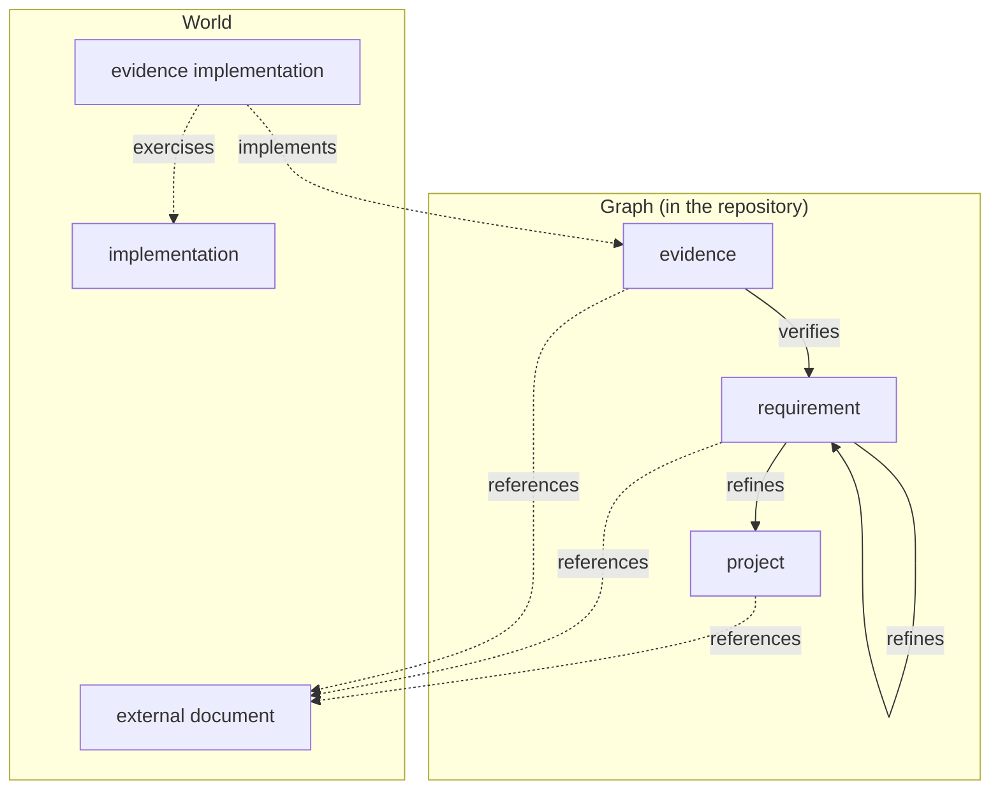

# mio — Model

Nodes, edges, and states of the graph.

## Diagram

Every arrow is an edge, and every edge is a record mio holds. Dotted arrows have an end in the world.

## Nodes

Six nodes. Three live in the graph: mio assigns each an `id`, and each carries text. Three live in the world: each is identified by a `target`, carries nothing, and has no record of its own — it appears wherever an edge names it. A target is `path` (repo-root-relative, `/`-separated, optional `symbol` or `lines`) or `uri`. Which world node a target is follows from the edge that names it; one target may be several.

| Node | Lives in | Identified by | Is |
| --- | --- | --- | --- |
| project | graph | id | the system; exactly one; root of the refines tree |
| requirement | graph | id | a statement of intent |
| evidence | graph | id | a statement of how one requirement is verified; belongs to exactly one requirement |
| external document | world | target | what a node references |
| evidence implementation | world | target | what implements an evidence: a test function, a checklist, an alert rule |
| implementation | world | target | what evidence implementations exercise: code, schema, configuration |

The world never carries anything written by mio.

## Edges

An edge is a recorded relation between two nodes. Its origin is a *judgment*, asserted by a human or an agent and only auditable, or an *observation*, recomputable by measuring the world.

| Edge | Subject → object | Ends | Origin | Held by |
| --- | --- | --- | --- | --- |
| refines | requirement → requirement \| project | graph → graph | judgment | the finer requirement |
| verifies | evidence → requirement | graph → graph | judgment | the evidence |
| implements | evidence implementation → evidence | world → graph | judgment | the evidence, as `implemented-by` |
| exercises | evidence implementation → implementation | world → world | observation | the observed layer, with provenance |
| references | any node → external document | graph → world | judgment | the node |

refines, verifies from SysML; implements from ISTQB.

- A one-to-many relation is held by the many side. Traversal in the other direction is an index built at load.
- An edge exists only while both ends exist.
- A world node is held only by the graph side. exercises and `implemented-by` name the same evidence implementation by the same target; that is the join between the two layers.

## States

States are computed, never stored. Subject side: present participle. Object side: past participle. Negation: `not`.

| Noun | State | Holds when |
| --- | --- | --- |
| target | resolving | what it names exists at HEAD; `uri` is not checked |
| evidence implementation | implementing | some evidence lists it in `implemented-by` |
| | exercising | some exercises record has it as subject |
| evidence | verifying | the requirement it names exists |
| | implemented | `implemented-by` is non-empty and every target is resolving |
| requirement | refining | the node it names exists; the project alone is not refining |
| | refined | some requirement refines it |
| | verified | some evidence verifies it |
| | traced | every evidence verifying it is implemented and every requirement refining it is traced |
| implementation | exercised | some exercises record includes it |

`check` reports the cause of a negative state. The universe for `not implementing` and `not exercised` is what the ingested coverage reports enumerate.

## Transitions

A state moves when a judgment is written, an observation is ingested, or the world changes. The last has no verb.

| Transition | Cause |
| --- | --- |
| requirement: not verified → verified | verifies |
| requirement: not refined → refined | refines |
| evidence: not implemented → implemented | implements, with resolving targets |
| evidence implementation: not implementing → implementing | implements |
| evidence implementation: not exercising → exercising | exercises |
| implementation: not exercised → exercised | exercises |
| requirement: not traced → traced | the last missing implements beneath it |
| requirement: traced → not traced | verifies or refines adding an unfulfilled node beneath it |
| evidence: implemented → not implemented | world: the target no longer resolves |
| evidence / requirement: verifying / refining → not | world: the parent node was removed |

World-caused transitions only lower a state.

## Deferred

Freshness (`basis`, `fresh` / `stale`), identifier format, file layout of the observed layer.
